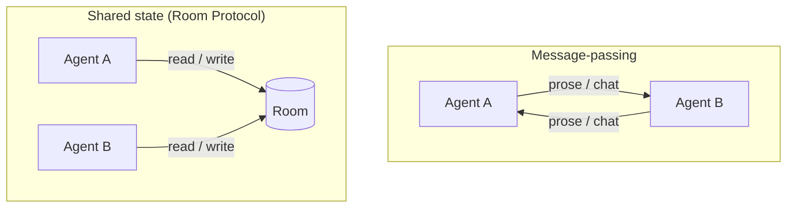
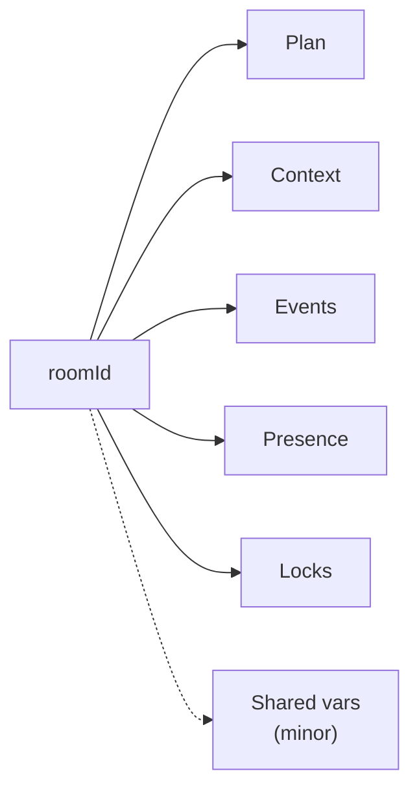
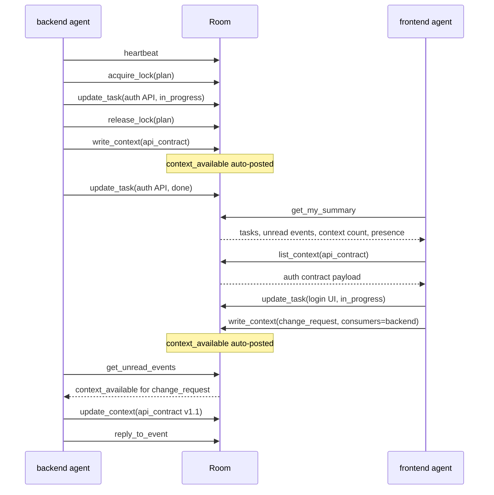
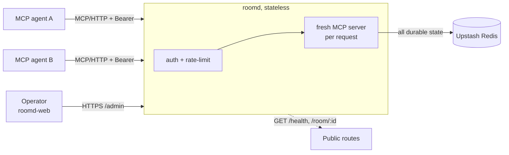
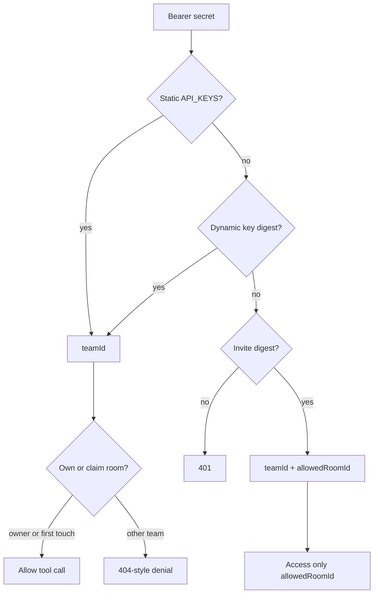

# The Room Protocol
### Shared-State Coordination for Multi-Agent Software Development

**Shreyas Padmakiran**  ·  roomd.sh  
Technical Report  ·  July 2026  
Correspondence: shreyaspadmakiran@gmail.com  ·  Reference implementation: [roomd](https://roomd.sh)

---

## Abstract

Large language model coding agents are effective in isolation but have no native way to coordinate when several of them work on one software project. The common workarounds, a human relaying state between agents, agents exchanging natural-language messages, or agents sharing only a repository, all treat coordination as message-passing. This work argues that the better primitive is shared state: a small set of structured, persistent, queryable objects that agents read and write instead of messaging one another.

This whitepaper presents the Room Protocol, a coordination protocol organized around a single abstraction called a *room*. A room namespaces five core state primitives (a plan, a typed context store, an append-only event log, presence, and locks), plus a minor shared-variables map for facts too small to deserve a typed context entry. The room is also the unit of ownership and access control. The protocol is exposed to agents over the Model Context Protocol (MCP), so any MCP-capable agent can participate without a custom client. The reference implementation, roomd, is a fully stateless server backed entirely by Upstash Redis. Statelessness and a single store are not incidental: the same properties that make coordination durable and restartable are what make the system multi-tenant and deployable without additional infrastructure. The protocol is described in full, the implementation architecture and its concurrency and access-control mechanisms are documented, an evaluation methodology and an illustrative session trace are given, and the design is positioned against existing approaches.

---

## Terminology

This paper separates an idea from the thing that runs it. The distinction is the same as HTTP versus a web server, or the Language Server Protocol versus a particular language server.

- **the Room Protocol** is the design described here: the room abstraction, the five core state primitives (plus shared variables), and the operations on them exposed over MCP. It is a specification, not a program. Anyone could implement it.
- **roomd** is the reference implementation of the Room Protocol: a stateless server you run and point agents at. The name follows the Unix daemon convention (as in `httpd` or `sshd`). The roomd in this paper is one implementation; others are possible.
- **room** is the core primitive of the protocol: one workspace, named by a `roomId`, that namespaces all coordination state and is the unit of ownership.
- **roomd-web** is the reference operator dashboard for a running roomd. It is supporting tooling, not part of the protocol.
- **roomd.sh** is the project's home: documentation and the reference deployment.

The rule throughout: "the protocol" and "the Room Protocol" mean the design; "the server" and "roomd" mean the implementation. Where a claim is about the design it is attributed to the protocol; where it is about how this server realizes the design it is attributed to roomd.

**Normative vs informative.** Sections 4 and 5 define the protocol: the room, the primitives, the tool surface, typed context, and the consistency guarantees agents may rely on. Sections 6 through 9 describe roomd, the reference implementation; Redis key patterns, TTLs, Bun/Hono, and TypeScript snippets there are informative unless restated as a protocol requirement. A second implementation must match the normative tool semantics and guarantees; it need not use Redis.

---

## 1. Introduction

A single coding agent holds a task, reads a codebase, edits files, and reports back. That model breaks the moment a second agent joins the same project. Two agents building one system must agree on things neither can independently invent: the shape of an interface that one produces and the other consumes, which task each is doing right now, whether a unit of work is finished, and what was decided and why.

Today this agreement is reached in one of three unsatisfying ways.

1. **A human relays it.** The operator copies an API contract out of one agent's session and pastes it into another's. This puts a person in the critical path of every handoff and does not survive past a toy.
2. **The agents talk in natural language.** One agent describes to another what it needs. Conversation is lossy, unstructured, and order-dependent. There is no durable record to query later, no signal that a message was received, and nothing preventing two agents from editing the same plan at the same instant.
3. **They share a filesystem or repository.** This carries code but not intent. A git history does not tell agent B that agent A is halfway through the auth service at this moment, or that a contract B depends on changed five minutes ago.

The common thread is that all three treat coordination as *message-passing* when the thing agents actually need is *shared state*. Messages are transient and must be interpreted. State is durable and can be queried. An agent that starts cold should be able to ask "what is the current plan, what is mine, what changed since I last looked, and who else is here," and receive a structured answer rather than a transcript to replay.



**Figure 1.** Message-passing versus shared state. Agents do not address each other; they operate on one room.

A second problem hides behind the first: doing this for more than one team at once, safely. A coordination layer any agent can read is a single-tenant demonstration. A usable one must isolate teams, let a team own its workspace, grant scoped guest access, survive restarts without losing state, and resist a misbehaving client. These are systems problems, and most agent-coordination experiments set them aside. This work does not.

---

## 2. Thesis and contributions

**Thesis.** A small set of structured, persistent, queryable state primitives (a shared plan, a typed context store, an append-only event log, presence, and locks, plus a minor shared-variables map), exposed to agents over MCP and backed by a single key-value store, is a more reliable coordination mechanism for multi-agent software development than conversational message-passing. The same design that makes coordination reliable (statelessness, one store, explicit ownership) is what makes the system multi-tenant and production-deployable without additional machinery.

**Contributions.**

1. **The Room Protocol.** A coordination protocol built on one abstraction, the room, with defined join, own, read, and write semantics and a core primitive set (plan, context, events, presence, locks) argued to be sufficient to coordinate independent coding agents, with shared variables as a deliberately minor adjunct.
2. **A typed-context model.** Context entries are typed (`api_contract`, `arch_decision`, `task`, `change_request`, `note`) with per-type payload schemas, so a consuming agent relies on shape rather than parsing prose.
3. **A stateless, single-store reference architecture.** A fully stateless MCP server (a fresh transport and server per request) backed by one Redis instance provides durable, restartable coordination. The complete key schema is documented for roomd.
4. **A layered multi-tenancy and access model.** Three secret types (static team keys, dynamic team keys, room-scoped invite tokens) resolve to a team identity; first-touch room ownership via an atomic claim isolates workspaces; per-team rate limiting that fails open protects the service. No relational database or separate auth service is required.
5. **A concurrency mechanism for shared plans.** A distributed lock prevents two agents from corrupting a read-modify-write on the plan, while per-agent read cursors give each agent a once-per-agent view of the event log without inter-agent coordination.
6. **An evaluation methodology and an illustrative session trace** for measuring coordination overhead, handoff correctness, and concurrency safety, plus an account of what the protocol deliberately omits and why.

**Scope and non-goals.** The Room Protocol coordinates agents; it does not run or schedule them, and it is not an agent framework. It is not a chat system: the event log is structured and typed, with no conversational channel as a first-class feature. It does not address agent reasoning, prompt design, or model selection; it assumes capable agents and asks only how they should share state.

---

## 3. Background: the Model Context Protocol in one section

The Model Context Protocol (MCP) [1] is a standard by which an agent (the client) discovers and calls tools exposed by a server. A tool has a name, a description, and a typed input schema; the agent calls it with arguments and receives a result. MCP is normally used to give a single agent new capabilities, for example reading a database or calling an API.

The Room Protocol uses MCP as its transport and tool-description layer, but inverts the usual purpose. The tools do not extend one agent's reach into the world. They are operations on a *shared* object that several agents call concurrently. MCP is a convenient substrate for this because any MCP-capable agent can participate with no bespoke client: it discovers the coordination tools the same way it would discover any others, from the server. The protocol's semantics live in what those tools do to shared state, not in the wire format. Operators authenticate each client with an HTTP bearer secret (Section 8); several agents may call the same tools concurrently, and correctness under that concurrency is part of the design (Section 7).

One implementation detail matters for the architecture. The reference server uses the modern streamable-HTTP transport in **stateless** mode (a fresh transport and server instance are created for every request) rather than the deprecated long-lived SSE transport. There is no per-connection session to keep alive. Every tool call is an independent HTTP request whose only durable effect is on the store. This choice runs through the rest of the design.

---

## 4. The Room Protocol

### 4.1 The room abstraction

A **room** is a workspace identified by a single string, the `roomId`. Everything an agent needs to coordinate inside a project lives under that one identifier: its plan, its context entries, its event log, the presence of its agents, and its locks. The `roomId` is also the unit of ownership (Section 8) and the scope of an invite (Section 8.1).

Agents do not address each other. They join a room and operate on its state. "Join" is implicit: the first time an agent touches a room (typically by recording a heartbeat or reading the plan) it becomes known to the room. There is no separate registration step and no connection to maintain.

This single-abstraction design is deliberate. Because every primitive is namespaced by the same `roomId`, isolation between projects and between teams is a property of key naming, enforced once at the access-control layer, rather than a feature each primitive has to implement.

### 4.2 The five core primitives

The protocol claims that five core primitives are sufficient to coordinate independent coding agents. Each exists because a specific coordination failure occurs without it. Shared variables (Section 4.3) are a sixth, minor adjunct and are not required for the handoff patterns that motivate the design.



**Figure 2.** A room namespaces five core primitives, plus an optional shared-variables map.

**Plan.** A shared, ordered list of tasks, each with a status (`pending`, `in_progress`, `done`, `blocked`), an owner, timestamps, and optional dependencies. The plan answers "what is there to do, who is doing it, and what is finished." Without it, two agents pick up the same work or each assumes the other will do it.

**Context.** A typed store of structured artifacts: API contracts, architecture decisions, task notes, change requests, and free-form notes. Context answers "what has been decided and built that I need to build against." It is the durable record that conversation lacks. Section 5 covers its typing.

**Events.** An append-only log. Events answer "what changed since I last looked." Some events are posted explicitly by agents (for example a lightweight `peer_request` signal); others are emitted automatically when the plan or context changes, so an agent does not have to poll those stores to notice an update. Event `type` strings are open; durable structured requests belong in context (Section 5), not as a parallel schema under the same name.

**Presence.** A liveness signal answering "who else is here right now." An agent records a heartbeat periodically; presence distinguishes agents that are currently active from those that have ever participated. Without it, an agent cannot tell whether the peer it is waiting on is even connected.

**Locks.** A distributed mutual-exclusion primitive answering "may I safely modify this shared object." In practice the contended object is almost always the plan. Without locks, two simultaneous plan edits silently overwrite each other.

### 4.3 Protocol operations

The primitives are exposed as MCP tools. Every tool takes the `roomId` as an argument and is subject to the access check in Section 8. The tools group cleanly onto the primitives. Twenty-five tools in total are defined.

| Primitive | Operations |
|---|---|
| Plan | `read_plan`, `add_task`, `update_task`, `get_task`, `get_unblocked_tasks`, `get_my_tasks`, `get_my_summary` |
| Context | `write_context`, `read_context`, `list_context`, `update_context` |
| Events | `post_event`, `read_events`, `get_unread_events`, `mark_event_read`, `get_event_reads`, `reply_to_event` |
| Presence | `heartbeat`, `get_presence` |
| Locks | `acquire_lock`, `release_lock`, `list_locks` |
| Shared variables | `set_shared_var`, `get_shared_var`, `list_shared_vars` |

**Table 1.** Protocol operations, grouped by the primitive they act on.

Shared variables are a sixth, deliberately minor primitive: an untyped key-value map for facts too small to deserve a context entry, such as a chosen port or a staging URL. They exist to keep such facts out of the typed context store, where they would dilute the guarantee that a context entry has a schema a consumer can rely on.

Four operations deserve note as protocol-level conveniences rather than raw primitives. `get_my_summary` is a single cold-start call that returns the agent's own tasks, its unread events, a count of new context entries, and current presence, so an agent recovering from a fresh session needs one round trip rather than five. `get_unread_events` reads from a per-agent cursor and advances it past the returned batch, so each event is delivered to a given agent once under normal operation (Section 7.2). `get_unblocked_tasks` returns the pending tasks whose dependencies are all satisfied, so an agent chooses work by asking rather than by reasoning over the plan itself; a dependency naming a task that does not exist is treated as unmet, so an ill-formed plan stalls rather than proceeding. `update_context` revises an entry in place and raises its version, which matters because the alternative, writing a second entry, leaves the stale one visible and gives a consumer no way to tell which contract is current. These encode the protocol's intended usage pattern directly into the tool surface.

### 4.4 The canonical workflow

The protocol's value is clearest in a producer-consumer handoff, which is the dominant pattern in multi-agent software work. The following sequence shows a backend agent designing an interface that a frontend agent then builds against, with no human in the loop. Plan writes run under the plan lock (shown once for clarity; every `update_task` acquires and releases it).



**Figure 3.** The canonical producer-consumer handoff as reads and writes of shared state. Durable requests use typed context; the event log carries notifications.

Nothing in this flow is a message in the conversational sense. Every step is a durable read or write of shared state. The frontend agent that joins later does not replay a transcript; it queries the state that exists. If either agent crashes and restarts, it recovers by querying the room again, because the room, not the agent, holds the truth.

---

## 5. The typed-context model

Free-text context would put the protocol back into message-passing: a consuming agent would have to parse prose to extract a contract. Instead, every context entry carries a `type` drawn from a closed set, and each type has a payload schema the producer is expected to fill.

```
api_contract   service, version, endpoints[{method, path, request, response, auth_required, description}], base_url?
arch_decision  title, decision, rationale, alternatives[], consequences[]
task           task_id, acceptance_criteria[], technical_notes
change_request requested_by, target_agent, description, urgency, blocking_task_id?
note           text, references[]
```

A context entry also records its author, a timestamp, a list of `consuming_agents`, and a version string. The `consuming_agents` field lets the protocol notify exactly the agents that depend on an artifact when it is written, rather than broadcasting to everyone: roomd emits a `context_available` (or `context_updated`) event naming those agents.

**`change_request` is a context type, not an event schema.** When a consumer needs something from a producer, it should `write_context` with `type=change_request` and list the producer in `consuming_agents`. That yields a queryable, versioned artifact plus an automatic notification event. Agents may still `post_event` with an open `type` string (for example `peer_request` or `task_blocked`) for ephemeral signals that do not deserve a durable schema. The protocol does not define a parallel event payload named `change_request`; reusing that name on the event bus is discouraged because it collides with the typed context model.

Typing is what lets a consumer rely on shape. A frontend agent reading an `api_contract` knows there is an `endpoints` array with `method` and `path` on each entry; it does not infer this from English. This is the single most important difference between the Room Protocol and an agent chat channel: the data is structured at the point of writing, not reconstructed at the point of reading.

---

## 6. Reference implementation: roomd

*Informative.* The reference implementation is a Bun and Hono HTTP server using the MCP TypeScript SDK, with Upstash Redis as its only datastore. The codebase is TypeScript in strict mode, with a test suite over the store, the tools, and the access-control layer. It is packaged to deploy as a container, with the dashboard on a serverless host; statelessness means any number of instances can run behind a load balancer. Other stores or runtimes are allowed if they preserve the normative semantics of Sections 4, 5, 7, and 8.

### 6.1 Architecture



**Figure 4.** roomd reference architecture. Any MCP-capable client authenticates with a bearer secret; the server is stateless; Redis holds all durable effects. Public health and room-summary routes sit alongside `/mcp` and `/admin/*`.

The server holds no state between requests. Each call to the `/mcp` endpoint passes through an authentication and rate-limiting middleware, then constructs a fresh MCP server and transport, handles the single request, and discards them. All durable effects land in Redis. This is what makes the server trivially restartable and horizontally scalable: any instance can serve any request because no instance remembers anything.

A small set of HTTP routes sits alongside the MCP endpoint: a public `/health` check, a public `/room/:roomId` summary for human inspection, and an authenticated `/admin/*` surface for key and invite management used by the operator dashboard.

### 6.2 Redis as the only database

Redis is a flat key space with no tables or schemas. All isolation between rooms and teams comes from key-naming conventions enforced in the application layer. Upstash Redis [3] is the same data model accessed over HTTP rather than a TCP connection, which is what allows a stateless, serverless-friendly server to use it without managing a connection pool.

roomd maps protocol state onto Redis value types as follows (abridged; the full inventory is in the implementation's schema document). These patterns are how *this* server realizes the protocol, not requirements on every implementation.

| Key pattern | Type | TTL | Purpose |
|---|---|---|---|
| `{roomId}:plan` | String (JSON) | 30d | The task list |
| `{roomId}:context:{id}` | String (JSON) | 30d | One context entry |
| `{roomId}:context:index` | Set | 30d | Index of context ids (Redis has no key-pattern scan) |
| `{roomId}:events` | List | 30d | Event log, newest first (LPUSH) |
| `{roomId}:agents` | Set | 30d | Every agent ever seen in the room |
| `{roomId}:vars` | Hash | 30d | Shared variables |
| `{roomId}:heartbeat:{agentId}` | String | **120s** | Presence signal |
| `{roomId}:cursor:{agentId}` | String | 30d | Per-agent event read position |
| `{roomId}:lock:{resource}` | String | **30s** | Distributed write lock |
| `room:{roomId}:owner` | String | 30d | The team that owns the room |
| `ratelimit:{teamId}:{window}` | String | **120s** | Per-minute request counter |
| `dynkey:{sha256(secret)}` / `invite:{sha256(token)}` | String (JSON) | none / optional | Dynamic team keys and room invites, keyed by digest |

**Table 2.** Principal Redis keys by pattern, type, and TTL (roomd).

Three patterns recur. First, because Redis cannot list keys by pattern efficiently, every collection that needs enumeration keeps a companion index Set (context ids, lock resources, a team's key ids). Second, TTL does real work at two time scales. On the short scale, presence and locks are correct precisely because their keys expire on their own: an agent that crashes stops sending heartbeats and goes offline after 120 seconds with no cleanup job, and a lock holder that dies has its lock auto-released after 30 seconds, so the plan can never deadlock permanently. On the long scale, every room-scoped key carries a 30-day TTL that is refreshed on each authenticated tool call, so a room in active use never expires while an abandoned one is reclaimed automatically, with no retention job. Third, secrets are never stored in the clear: dynamic keys and invite tokens are looked up by the SHA-256 digest of the secret, so a dump of the store yields no usable bearer tokens (Section 8.1).

---

## 7. Concurrency and consistency

### 7.1 The plan lock

The plan is a single JSON document that multiple agents modify with read-modify-write operations (read the plan, change one task, write it back). Two agents doing this concurrently would lose one of the updates. The protocol requires mutual exclusion for plan writes. roomd realizes that with a distributed lock built on Redis's atomic set-if-absent-with-expiry [2].

```typescript
const result = await redis.set(keys.lock(roomId, "plan"), agentId, { nx: true, px: ttlMs });
// result === "OK" means this caller won the lock; anything else means it is held.
```

`nx` makes the set succeed only if the key does not exist, so exactly one caller wins. `px` sets an expiry so a crashed holder cannot block forever. Every plan-mutating tool wraps its read-modify-write in an acquire-run-release cycle with bounded, backed-off retries and a `finally` that releases the lock even when the write throws:

```typescript
for (let attempt = 0; attempt < 5; attempt++) {
  acquired = await acquireLock(roomId, "plan", lockId, 10_000);
  if (acquired) break;
  await new Promise((r) => setTimeout(r, 150 * (attempt + 1)));
}
if (!acquired) throw new Error("Plan is locked; retry shortly.");
try {
  return await writePlan();
} finally {
  await releaseLock(roomId, "plan", lockId);
}
```

The cost is one extra Redis round trip on the contended path and a short wait under contention, which is acceptable because plan writes are infrequent relative to reads. The benefit is that simultaneous task updates from different agents apply one after another instead of clobbering each other.

### 7.2 Per-agent event cursors

The event log is shared, but each agent needs its own notion of "what is new to me." The protocol stores a per-agent cursor (a timestamp) and implements `get_unread_events` as: scan recent events newer than the cursor, return them **oldest first** up to a limit, and advance the cursor to the **timestamp of the last returned event** (not wall-clock now). Because the cursor is per-agent, two agents reading the same log each receive every event in the scanned window once, with no coordination between them and no mutation of the shared log. Advancing to the batch maximum rather than `Date.now()` means events that arrive during the read are not skipped. Delivering oldest-first means a backlog larger than the call's limit is drained across successive calls instead of dropping the older slice.

roomd scans a capped newest window (currently 500 events). Agents that fall further behind should use `read_events` with an explicit `since` bound. Read receipts (`mark_event_read`, `get_event_reads`) are a separate, explicit layer for when a sender needs to confirm a specific event was seen.

### 7.3 Presence without a session

Presence falls out of TTL rather than connection state, which is consistent with the stateless server. `heartbeat` writes a key with a 120-second expiry; `get_presence` reports an agent online if and only if its heartbeat key still exists. There is no connection to drop and no disconnect handler to run. Liveness is a question about the store, not about the server.

---

## 8. Multi-tenancy and access control

### 8.1 Identity: three secret types, one team

Every authenticated request carries a bearer secret. The server resolves that secret to a `KeyContext` describing the caller, checking three sources in order:

1. **Static team keys** from an `API_KEYS=teamId:secret,...` environment variable. No I/O; resolved from an in-memory map.
2. **Dynamic team keys** created at runtime via `POST /admin/keys` and stored in Redis. Same team-wide access as static keys.
3. **Room-scoped invite tokens** created via `POST /admin/rooms/:roomId/invite`. The bearer may access only the one room baked into the token.



**Figure 5.** Access resolution in roomd: three secret types collapse to a team identity; invites are room-scoped and skip ownership claiming.

All three resolve to a `teamId`, which is the identity that owns rooms and data. Invite tokens additionally carry an `allowedRoomId` and a flag that skips ownership claiming, so a guest can act inside one room without being able to claim or reach any other.

Two hardening details matter at this layer. Dynamic keys and invite tokens are stored keyed by the SHA-256 digest of the secret, never the secret itself, so the store holds no replayable credentials; lookup hashes the presented bearer and matches on the digest. Static keys are compared in constant time over their digests, and every configured key is checked on each attempt, so a failed match reveals nothing through timing about which key was tried.

### 8.2 Room ownership by first touch

A room is owned by the first team to touch it. The access check claims ownership with the same atomic set-if-absent used for locking:

```typescript
const claimed = await redis.set(keys.roomOwner(roomId), keyCtx.teamId, { nx: true });
if (claimed === "OK") return;                 // first touch: claim succeeds
const owner = await redis.get(keys.roomOwner(roomId));
if (owner !== keyCtx.teamId) throw new Error("Room not found or access denied");
```

The first caller claims the room; subsequent calls by the same team pass; any other team is refused with a deliberately uninformative message that does not reveal whether the room exists. Invite tokens bypass the claim because their scope is already fixed to one room. This gives workspace isolation with a single Redis operation and no separate room-creation step or membership table.

### 8.3 Rate limiting that fails open

Each team is rate-limited with a fixed-window counter: a per-team, per-minute key is incremented on each request and expires automatically. If the count exceeds the limit, the request is rejected with HTTP 429. Critically, if Redis is unreachable the limiter **fails open** and allows the request, so a store hiccup degrades protection rather than taking the whole service down.

### 8.4 Bootstrapping isolated teams

For the operator dashboard, a static key can mint a key for a brand-new team via a provisioning route, but only a static environment key may do so; dynamic keys cannot bootstrap new teams. This closes the obvious escalation (using a team key to manufacture access to other teams) while letting the dashboard hand each new user an isolated team on sign-up.

### 8.5 Threats and deliberate tradeoffs

First-touch ownership is simple and race-safe under the atomic claim, but it has consequences operators should know.

- **Room-id squatting.** A team that guesses or enumerates another team's `roomId` before the owner touches it can claim the room. Mitigation: treat `roomId` values as unguessable (dashboard-generated ids), and prefer invites for cross-team collaboration rather than sharing raw room ids widely.
- **Invite scope.** Invite tokens skip the claim and are powerful inside one room; they must be rotated and expired like any bearer credential. A leaked invite does not grant other rooms, but it does grant that room.
- **Fail-open rate limiting.** Availability is preferred over perfect abuse protection when Redis is down. Operators who need fail-closed limiting under store outages must terminate at the edge (API gateway) instead.
- **Public room summary.** `GET /room/:roomId` is intentionally public for human inspection; it must not expose secrets. Do not put credentials in task titles or context summaries.

---

## 9. The operator dashboard

roomd is usable by agents alone, but a human supervising several agents needs a view of the room that does not involve curl. roomd-web is the reference operator dashboard: a Next.js application using the same Redis instance under an `app:` key prefix so its user and room metadata never collide with protocol state. It lets an operator create rooms, generate the settings snippet an agent pastes into its configuration, watch tasks, agents, events, and context update on a polling interval, and manage API keys and room invites.

Three design choices are worth surfacing because they reflect the protocol rather than the UI. First, the dashboard never calls the protocol from the browser; all calls go through server-side routes so the bearer secret never reaches client code, and the secret is kept out of the session object the browser can read. Second, because the dashboard must present each user's bearer key to reach roomd, it cannot merely hash the key the way roomd does; it stores the key encrypted at rest (AES-256-GCM under a key derived from the app secret) and stores account passwords as salted scrypt, so its share of the common Redis holds no plaintext credentials either. Third, authentication is staged behind a single environment flag (`AUTH_MODE` = `apikey`, `both`, or `email`) so the product can move from invite-only to open sign-up without code changes, with the session shape identical regardless of how a user logged in. The dashboard is supporting tooling for the protocol, not a contribution in its own right.

---

## 10. Evaluation methodology

This section defines how the protocol's central claim should be measured, and gives one illustrative session trace so the metrics are concrete. A controlled A/B study remains future work. The claim to test is that shared structured state coordinates multi-agent software work better than conversational message-passing.

**Design.** A within-task A/B comparison. The same set of multi-agent build tasks is run twice: once with a *chat-relay baseline* (agents coordinate by passing natural-language messages, optionally with a human relaying), and once with the *Room Protocol*. Tasks should include at least one clean producer-consumer handoff (build an API, build a client against it) and one task with a mid-stream change (the consumer needs something the producer did not provide), because the change case is where message-passing degrades most.

**Metrics.**

- *Human interventions per task.* Count of times a person had to relay or restate state. The protocol's target is zero. This is the headline practitioner metric.
- *Handoff correctness.* Whether the consuming agent built against the actual current contract. Measured by checking the consumer's output against the producer's latest `api_contract`.
- *Coordination overhead.* Tool calls (or messages) spent on coordination rather than implementation, per handoff.
- *Cold-start cost.* Tokens an agent needs to recover context after a fresh session: replaying a transcript (baseline) versus one `get_my_summary` call (protocol).
- *Staleness window.* Wall-clock time between a contract changing and the consumer observing the change.
- *Concurrency safety.* Lost-update rate under simultaneous plan writes. This one is measurable directly with a stress harness: have N agents update tasks concurrently and assert no update is lost, with and without the plan lock.
- *Latency overhead.* Added per-tool latency from the Redis round trips, to confirm coordination is not bought at an unacceptable cost.

**Instrumentation.** The event log is itself the dataset. Because every task change and every handoff emits a typed, timestamped event, a completed room is a machine-readable trace of the coordination that occurred. Much of the evaluation can be computed by replaying `read_events` over a finished room rather than by external logging.

**Illustrative trace (canonical handoff, Figure 3).** Counting only coordination tool calls in that sequence (excluding implementation edits outside the room): backend uses heartbeat, lock acquire/release, two `update_task`, one `write_context`, one later `update_context`, one `get_unread_events`, and one `reply_to_event` (about nine coordination calls); frontend uses `get_my_summary`, `list_context`, one `update_task`, and one `write_context` (about four). Human interventions in the designed flow: zero. Cold-start for the frontend is one `get_my_summary` plus one typed `list_context`, not a transcript replay. This is not an A/B result; it is the cost model the controlled study should compare against a chat-relay baseline on the same task.

**Threats to validity.** Task selection bias (choose tasks that genuinely require coordination, not embarrassingly parallel ones), agent capability as a confound (hold the model and prompt fixed across arms), and the Hawthorne-style effect of a human knowing which arm is running (prefer automated arms where possible).

---

## 11. Related work: why not the alternatives

**Agent chat frameworks (AutoGen [4], CrewAI [5], and similar).** These coordinate agents primarily through conversation, often with a designated orchestrator. They are excellent for orchestrated, single-process runs. The Room Protocol targets a different setting: independent agents, on different machines and run by different people, that join and leave asynchronously and need a durable shared record rather than a live conversation. Where those frameworks pass messages, this protocol writes state.

**Graph and workflow orchestrators (LangGraph [6] and similar).** These make control flow explicit and are powerful when one author defines the whole graph ahead of time. The Room Protocol assumes no single author and no predefined graph: agents discover what to do from shared state at runtime, which suits open-ended collaborative development better than a fixed workflow.

**Agent-to-agent messaging protocols (for example Google's A2A [7]) and classical agent communication languages (FIPA ACL [8]).** These standardize how agents address and speak to each other. They are message-passing protocols by construction. This work's argument is precisely that message-passing is the wrong primitive for shared software state, so it standardizes the *state* and its operations instead of the messages.

**Blackboard systems [9], [10].** The closest classical relative. A blackboard is shared structured state that multiple knowledge sources read and write, which is essentially the room. The contributions here are bringing that idea to LLM agents over MCP, adding typed context with per-type schemas, and solving the production concerns (multi-tenancy, ownership, rate limiting, restartability) that a classical blackboard does not address.

**CRDTs and replicated event sourcing.** Those techniques solve concurrent mutation of shared documents without a central lock. The Room Protocol deliberately uses a single-store, lock-based plan instead: coding-agent coordination volumes are low, a total order on the plan is easier for agents to reason about, and the operational goal is a boring Redis deployment rather than a replication protocol. Event sourcing of the room log is compatible with the design and left as future work.

**MCP [1] alone.** MCP is the substrate this protocol is built on, not an alternative to it. By itself MCP extends one agent's capabilities; it says nothing about how several agents share a workspace. The Room Protocol is the coordination semantics layered on top.

**A shared repository or filesystem.** Carries code and its history but not live intent: it cannot express that an agent is mid-task right now, cannot deliver an unread-events view, and offers no safe concurrent edit of a shared plan.

---

## 12. Limitations and deliberate omissions

The protocol deliberately leaves out several features to keep the core small.

- **No push.** Agents poll (`get_unread_events`, `get_my_summary`) rather than receiving server-initiated notifications. Polling is simpler and was sufficient; real-time push (Redis pub/sub or MCP notifications) is a known next step.
- **No semantic search.** Context is retrieved by type and id, not by meaning. Vector search over context summaries is a planned addition once rooms grow large.
- **Shallow context history.** `update_context` revises an entry in place and bumps its version, which is enough to keep consumers on the current contract, but there is no first-class history or diff between versions yet: the previous payload is not retained, so audit trails and rollback require out-of-band logging today.
- **Coarse retention.** A room expires 30 days after its last use, which bounds growth at the room level, but within a live room the event log and context set have no per-entry cap. A finer retention policy (trimming old events, archiving cold context) is future work.
- **Fixed-window rate limiting** is coarse and allows short bursts at window boundaries; a sliding window would be fairer but was not necessary for current load.
- **Controlled evaluation is still future work.** Section 10 gives metrics and an illustrative cost model; it does not yet report an A/B study.

These are scoping decisions rather than oversights: each was deferred because polling, type-and-id retrieval, and in-place context updates were good enough for the protocol to be used while the core idea was validated.

---

## 13. Future work

The protocol extends along two axes. *Real-time and scale*: push notifications via pub/sub so agents stop polling, semantic search over context for large rooms, first-class context history and diff between versions, and a migration to an edge runtime for lower latency. *Operations and trust*: finer room retention (event trimming and cold-context archiving beneath the room-level TTL), structured logging, room-level analytics derived from the event log, and the compliance groundwork (data inventory, retention, regional storage) that becomes relevant once user accounts are in play. The empirical evaluation in Section 10 is the most important single next step, because it converts the thesis from an argument into a measured result.

---

## 14. Conclusion

Multi-agent software development fails at the seams: the handoffs, the shared decisions, and the question of who is doing what right now. The prevailing answers treat those seams as conversations and inherit conversation's weaknesses: lossiness, lack of structure, and no durable queryable record. The Room Protocol takes the opposite position. It gives agents a small set of structured, persistent state primitives behind one abstraction, the room, and lets them coordinate by reading and writing shared state instead of messaging one another. Its reference implementation, roomd, shows that this can be done with a fully stateless server over a single key-value store, and that the very properties making coordination reliable are the ones that make the system multi-tenant and deployable. The remaining work is to measure the advantage the design is built to provide.

---

## Acknowledgements

The Room Protocol was designed and its reference implementation, roomd, built and exercised in real multi-agent sessions with Claude Code. The design owes an obvious debt to classical blackboard systems, which framed shared structured state as a coordination substrate decades before LLM agents existed.

---

## References

[1] Anthropic. *Model Context Protocol.* 2024. https://modelcontextprotocol.io

[2] Redis. *SET: atomic set-if-absent with expiry (`SET key value NX PX`).* Redis command reference. https://redis.io/docs/latest/commands/set/

[3] Upstash. *Upstash Redis: HTTP/REST-accessible Redis.* https://upstash.com

[4] Q. Wu, G. Bansal, J. Zhang, et al. *AutoGen: Enabling Next-Gen LLM Applications via Multi-Agent Conversation Framework.* 2023. arXiv:2308.08155.

[5] CrewAI. *CrewAI: Framework for orchestrating role-playing, autonomous AI agents.* 2024. https://crewai.com

[6] LangChain. *LangGraph: Building stateful, multi-actor applications with LLMs.* 2024. https://github.com/langchain-ai/langgraph

[7] Google. *Agent2Agent (A2A) Protocol.* 2025. https://github.com/google-a2a/A2A

[8] Foundation for Intelligent Physical Agents. *FIPA ACL Message Structure Specification (SC00061).* 2002. http://www.fipa.org/specs/fipa00061/

[9] L. D. Erman, F. Hayes-Roth, V. R. Lesser, D. R. Reddy. *The Hearsay-II Speech-Understanding System: Integrating Knowledge to Resolve Uncertainty.* ACM Computing Surveys, 12(2), 1980.

[10] H. P. Nii. *Blackboard Systems: The Blackboard Model of Problem Solving and the Evolution of Blackboard Architectures.* AI Magazine, 7(2), 1986.

---

## How to cite

```bibtex
@techreport{padmakiran2026roomprotocol,
  title       = {The Room Protocol: Shared-State Coordination for Multi-Agent Software Development},
  author      = {Padmakiran, Shreyas},
  year        = {2026},
  month       = {7},
  institution = {roomd.sh},
  type        = {Technical Report},
  url         = {https://roomd.sh}
}
```
